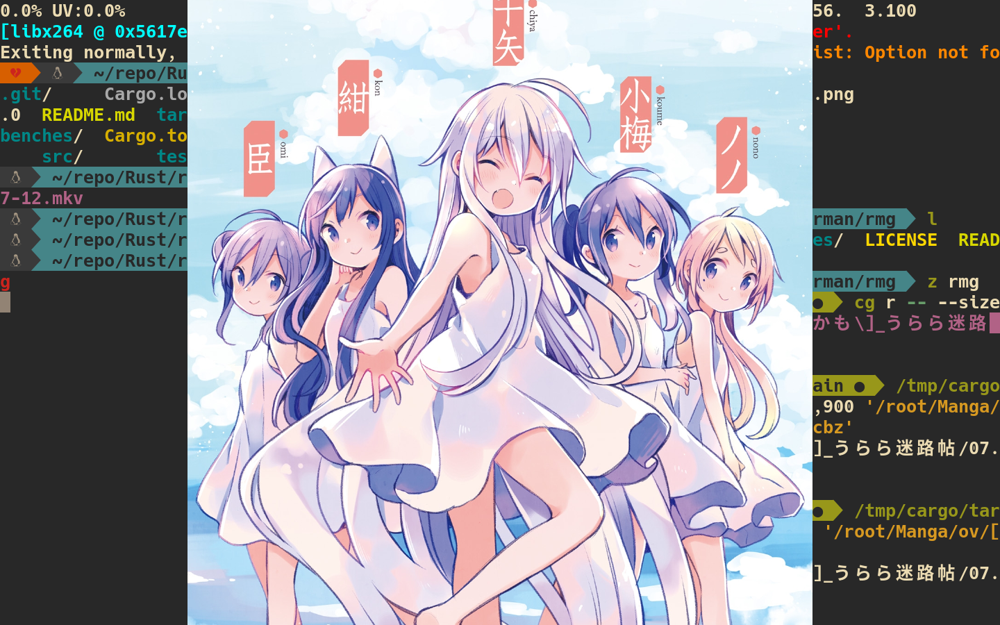

# rmg

> Rust: Tiny Manga/Image Viewer

## Demo



https://github.com/rsuu/rmg/blob/main/assets/2022-06-29.mp4

## Install

+ Dependency
  + Linux: x11 OR wayland
  + Windows: None
  + Mac: None(I DO NOT KNOW)
+ Optional Dependency
  + tar
  + zip
  + libheif

```bash
# github
Check here: https://github.com/rsuu/rmg/releases/

# cargo
cargo install rmg

# git
git clone --depth 1 https://github.com/rsuu/rmg
cd rmg
cargo build --release
```

## Usage

```bash
rmg ./tests/files/img.tar

# OR
rmg --size 600,600 ./tests/files/img.tar

# OR
rmg --size 600,600 --config ./tests/files/config.rs ./tests/files/img.tar
```

### KeyMap

|Key| |
|:-|:-|
k/Up | move up
j/Down | move down
h/Left | move left
r/Right | move right
q | quit

### Configuration

> config file: https://raw.githubusercontent.com/rsuu/rmg/main/tests/files/config.rs

`WARN:` You have to create the file by yourself.

+ configuration file path
  + Linux: `$HOME/.config/rmg/config.rs`
  + Mac: `$HOME/Library/Application Support/rmg/config.rs`
  + Windows: `C:\Users\<USER>\AppData\<USER>\rmg\config.rs`

## Supported formats

| Format | Supported | Default |Dependency
|:-|:-|:-|:-|
.jpg |✅ | ✅|
.png|✅| ✅|
.heic / .avif|🔬|❌|libheif
.gif|🔬|✅|
.aseprite|🔬|❌|

---
| Format | Supported | Default |Dependency
|:-|:-|:-|:-|
.tar |✅ | ✅| tar
.zip / .cbz |✅ | ✅| zip

## Features

```bash
# Add support for heic
cargo run --release -F "de_heic"


# for heic AND aseprite
cargo run --release -F "de_heic" -F "de_ase"

# [CpuExtensions](https://docs.rs/fast_image_resize/latest/fast_image_resize/index.html#resize-rgb8-image-u8x3-4928x3279--852x567)
cargo run --release -F "avx2"
    # for avx2
cargo run --release -F "sse4_1"
    # for sse4_1
```

## License

Licensed under either of [Apache License, Version 2.0](LICENSE-APACHE) or
[MIT license](LICENSE-MIT) at your option.

Unless you explicitly state otherwise, any contribution intentionally submitted
for inclusion in the work by you, as defined in the Apache-2.0 license, shall
be dual licensed as above, without any additional terms or conditions.
